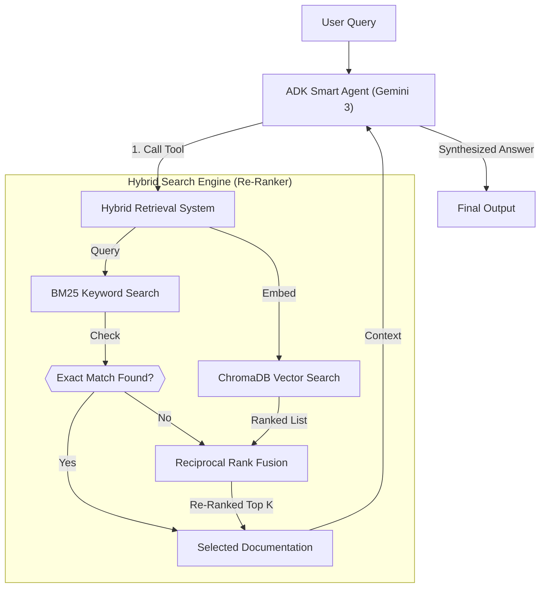

# PROJECT STATE: JUCE Documentation RAG System

## Overview
This project implements a local Retrieval-Augmented Generation (RAG) system for the JUCE C++ Framework documentation. It scrapes the official documentation, chunks it semantically (by API member), embeds it using a local Ollama model, and stores it in a ChromaDB vector database for efficient retrieval.

## Status
- **State**: Completed & Verified (Hybrid Search Implemented & Restored)
- **Ingestion**: 100% (1,120 pages processed, ~15,800 chunks stored)
- **Validation**:
  - `evaluate_rag_quality.py` benchmark passed (Exact Match + Fuzzy + Conceptual).
  - `test_rag.py` suite passed (including regression tests for exact ranking).
  - **Path Resolution Fix**: `adk_tools.py` and `build_rag.py` now use absolute paths to locate the database relative to the project root (`../data/juce_chroma_db`).
  - **Security**: Hardcoded network configurations (IPs/Macs) removed and moved to `.env`.


## Architecture
1.  **Scraper (`JuceScraper`)**:
    - Fetches documentation from `docs.juce.com`.
    - Parses HTML to identify semantic blocks:
        - `div.memitem`: Individual API methods/members.
        - `div.textblock`: Class descriptions.
    - **Fallback**: Uses character-based splitting for unstructured pages (e.g., indexes).

2.  **Processor (`JuceProcessor`)**:
    - Converts scraped items into cleaner `Document` objects.
    - Preserves metadata (URL, Title, Type).

3.  **Hybrid Search Engine**:
    - **Semantic**: ChromaDB with `embeddinggemma:latest` (Ollama).
    - **Lexical**: BM25Okapi (rank-bm25) with **custom punctuation-aware tokenization** to handle C++ namespaces (`juce::`).
    - **Fusion**: Reciprocal Rank Fusion (RRF) combining vector and BM25 scores.

4.  **Storage (`VectorStore`)**:
    - **Database**: ChromaDB (Persistent local storage).
    - **Index**: BM25 Sparse Index (`bm25_index.pkl`).
    - **Path**: `data/juce_chroma_db` (Project Root).

### Architecture Overview
The system implements a **Smart Agentic RAG** pipeline designed for high-precision technical documentation retrieval.

#### System Flowchart


### Core Components

**1. Smart Agent (Google ADK)**

* **Model**: `gemini-3-pro` (Native Integration via `google-adk`).
* **Role**: Orchestrates the interaction, understands user intent, and calls the retrieval tool when technical verification is needed.

**2. Hybrid Retrieval & Re-Ranking**

* **Concept**: Uses **Reciprocal Rank Fusion (RRF)** to combine the best of both worlds:
* **BM25**: Captures exact keyword matches (vital for class names like `AudioBuffer`).
* **Vector Search**: Captures semantic meaning (finding concepts like "distortion" or "clipping").


* **Mechanism**: The system runs both searches in parallel, normalizes their scores, and re-ranks the results to ensure the most relevant documents appear at the top.

**3. Native Environment**

* **Auth**: Leverages the Anti-Gravity environment's native Google credentials (ADC) for seamless, key-free operation.
* **Deployment**: Exposed via **Model Context Protocol (MCP)** server for IDE integration.

## Agentic RAG Architecture (ADK + Native Auth)

This project uses the **Google Agent Development Kit (ADK)** to deploy a smart agent within the Anti-Gravity environment.

* **`src/adk_tools.py`**: Wraps the local `VectorStore` as an ADK-compatible tool (`search_juce_docs`).
* **`src/adk_agent.py`**: Defines `JuceExpertAgent` using `gemini-3-pro` and native authentication.
* **`src/server.py`**: Exposes the ADK agent via MCP.

## File Structure

```text
/
├── data/                  # Main Database (Chroma + BM25)
│   └── juce_chroma_db/
├── src/
│   ├── __init__.py
│   ├── build_rag.py       # Main orchestration script
│   ├── adk_tools.py       # Tool wrapper for ADK
│   ├── adk_agent.py       # ADK Agent definition
│   └── server.py          # MCP Server implementation
├── tests/
│   ├── test_rag.py        # Automated test suite
│   ├── test_adk_integration.py # ADK validation tests
│   └── evaluate_rag_quality.py # Quality benchmark
├── X_cleanup/             # Moved extraneous files and scripts
├── requirements.txt
└── PROJECT_STATE.md

```

## Usage

### 1. Prerequisites

* Python 3.x
* Ollama running locally with `embeddinggemma` model pulled.
* **Google Anti-Gravity Environment** (Native Auth active).
* Run from **project root**.

### 2. Re-building the Database (If needed)

```bash
python src/build_rag.py

```

*Note: This script now automatically resolves the database path to `data/juce_chroma_db`.*

### 3. Running Validation

To run the standard test suite:

```bash
# RAG Tests
python tests/test_rag.py
# ADK Integration Tests
pytest tests/test_adk_integration.py -v

```

### 4. Running the MCP Server

Expose the Smart Agent as an MCP server.

```bash
fastmcp run src/server.py

```

### 5. Manual ADK Usage (Python)

```python
from src.adk_agent import JuceExpertAgent
# Run the agent natively
response = JuceExpertAgent.run("How to use AudioBuffer?")
print(response.text)

```

```
store = VectorStore() # Defaults to project root data path

# Hybrid Query (Recommended)
results = store.hybrid_query("Slider")

# Pure Vector Query (Fallback)
# results = store.query("How do I create a slider?")

for i in range(len(results['documents'][0])):
    print(f"Rank {i+1}: {results['metadatas'][0][i]['title']}")
    print(results['metadatas'][0][i]['url'])

```

## Maintenance

* **Updating Docs**: Run `build_rag.py` again to fetch the latest documentation.
* **Changing Model**: Update the `model_name` in `OllamaEmbeddingFunction` class in `build_rag.py`.

```

